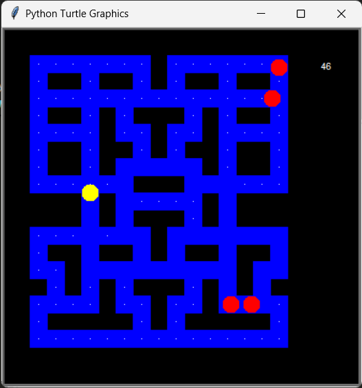
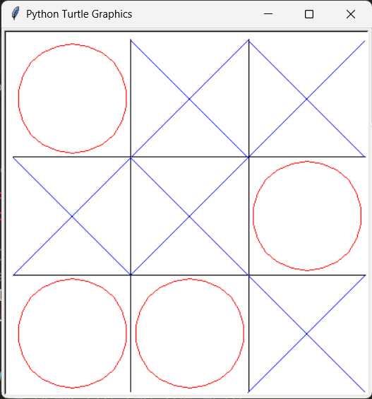

# Evidencia-TC1001S

Repositorio para el proyecto final de Herramientas computacionales: el arte de la programación

## Participantes

## Proyectos realizados

### Pac-Man

### Memory

### Tic-Tac-Toe

